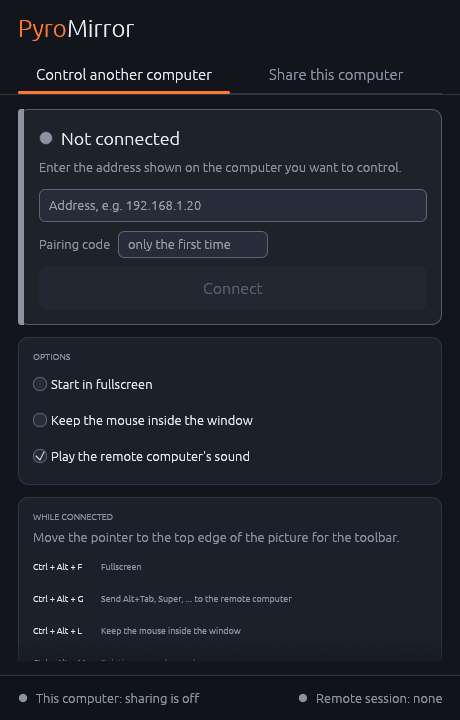
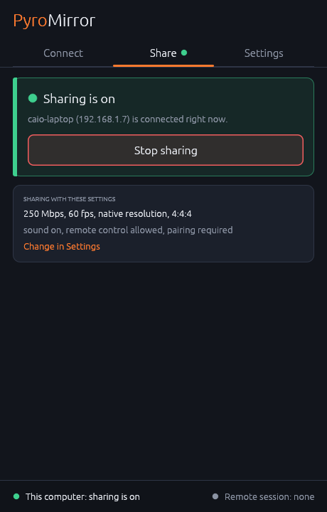
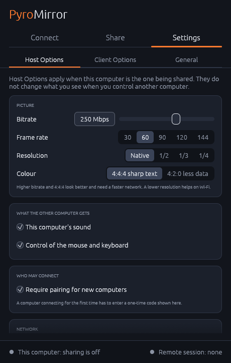
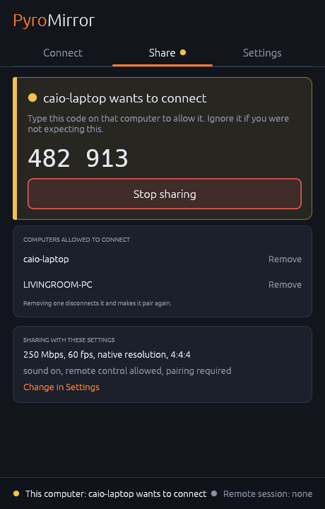

<p align="center">
  
</p>

<h1 align="center">PyroMirror</h1>

<p align="center">
  Low-latency remote desktop for your local network, for Windows and Linux.<br>
  <a href="https://caioquirino.github.io/pyromirror/"><strong>Website</strong></a> ·
  <a href="https://github.com/caioquirino/pyromirror/releases"><strong>Download</strong></a>
</p>

<p align="center">
  
  
  
</p>

PyroMirror streams a desktop between two computers using the [PyroWave](https://github.com/Themaister/pyrowave) GPU codec. Every frame is compressed on its own, so a lost packet costs a blurry patch in one frame instead of a stalled picture. It is built for wired networks with bandwidth to spare; it also works over Wi-Fi at a lower bitrate and resolution.

> **Beta.** It works between Windows and Linux machines, but it is young: there is no encryption yet, and Windows builds are not code-signed. See [What is missing](#what-is-missing).

## Contents

- [Install](#install)
- [Getting started](#getting-started)
- [While connected](#while-connected)
- [Settings](#settings)
- [Running in the background](#running-in-the-background)
- [Pairing and security](#pairing-and-security)
- [Requirements](#requirements)
- [What is missing](#what-is-missing)
- [Command line](#command-line)
- [Building from source](#building-from-source)
- [Releasing](#releasing)
- [Code signing policy](#code-signing-policy)
- [Privacy](#privacy)
- [License](#license)

## Install

Install the same version on both computers. Each [release](https://github.com/caioquirino/pyromirror/releases) has ready-made packages:

| System | File | Install with |
| :--- | :--- | :--- |
| Windows 10 / 11 | `pyromirror-<version>-windows-x86_64.msi` | Double-click; adds a Start menu entry |
| Windows, portable | `pyromirror-<version>-windows-x86_64.zip` | Unzip anywhere, run `pyromirror.exe` |
| Debian / Ubuntu 24.04+ | `pyromirror_<version>-1_amd64.deb` | `sudo apt install ./pyromirror_*.deb` |
| Fedora 40+ | `pyromirror-<version>-1.x86_64.rpm` | `sudo dnf install ./pyromirror-*.rpm` |
| Arch Linux | `pyromirror-<version>-1-x86_64.pkg.tar.zst` | `sudo pacman -U pyromirror-*.pkg.tar.zst` |
| Arch Linux (AUR) | `PKGBUILD` (`pyromirror-bin`) | `makepkg -si` next to the file |
| Other Linux | `pyromirror-<version>-linux-x86_64.tar.gz` | Unpack, run `./pyromirror` |

Windows builds are not code-signed yet, so Windows may warn about them and Smart App Control blocks them (see [Code signing policy](#code-signing-policy)).

## Getting started

Open **PyroMirror** on both computers.

### 1. On the computer you want to control: share it

Open the **Share** tab and press **Start sharing this computer**. The panel turns green, says "Sharing is on", and shows the address to connect to.

- On Linux, your desktop asks once for permission to share the screen and allow remote control. Tick the option to remember it if there is one.
- On Windows, allow PyroMirror through the firewall when asked.

### 2. On the other computer: add it

Open the **Connect** tab and choose **Add a computer**. Enter the address from step 1.



The first computer now shows a **pairing request** with a one-time 6-digit code. Type that code into the dialog on the second computer. This happens only once per pair of computers.

The computer is saved in your list under its own name.

### 3. Connect

Press **Connect** next to the computer. The remote desktop opens in its own window. From now on this is the only step.

The remote desktop is a program of its own: you can close the PyroMirror window and keep working in it. Opening PyroMirror again shows the connection, with **Disconnect**.

To stop, close the window or use **Disconnect**. On the shared computer, **Stop sharing** ends it from that side.

<br clear="right">

## While connected

Move the pointer to the top edge of the remote desktop window and a small handle appears. Click it for the session menu: fullscreen, keyboard grab, mouse lock, relative mouse, mute, disconnect, and the live frame rate and bitrate. If the handle sits where you need the edge (scrolling the map in a strategy game, say), drag it sideways; it stays where you leave it, in later sessions too.

While PyroMirror's tray icon is running, its right-click menu has the same options under "*name* session" for as long as you are connected. The tray icon on the remote computer has that menu too, so the options stay within reach through the session itself, whatever state the window on your side is in.

Relative mouse (for games that steer with the mouse) takes the pointer away, and the menu with it. A small note at the top edge shows the way out, `Ctrl + Alt + M`, for as long as it is on; the tray menu works too.

| Keys | Action |
| :--- | :--- |
| `Ctrl + Alt + F` | Fullscreen |
| `Ctrl + Alt + G` | Keyboard grab: send `Alt+Tab`, `Super` and similar to the remote computer |
| `Ctrl + Alt + L` | Mouse lock: keep the pointer inside the window |
| `Ctrl + Alt + M` | Relative mouse, for games |
| `Ctrl + Alt + Q` | Disconnect |

Keys are sent as physical keys, so the remote computer's keyboard layout decides what they type.

You see one mouse pointer: the remote computer's. Its shape (arrow, text cursor, resize handles) is sent to the viewer and drawn there, so it moves without network delay. On Linux desktops that cannot report the pointer separately, it is drawn into the picture instead and the viewer hides its own.

## Settings

Settings are grouped by what they affect.

**Host Options** apply when this computer is the one being shared.

- **Picture:** bitrate, frame rate, resolution (native, or 1/2 to 1/4 of it) and colour (4:4:4 keeps text sharp, 4:2:0 needs less data). A lower resolution and bitrate help on Wi-Fi.
- **What the other computer gets:** this computer's sound, and control of the mouse and keyboard.
- **Who may connect:** whether new computers have to pair.
- **Network:** port, packet size (jumbo packets need a network set up for them) and pacing.

These are locked while sharing is on.

**Client Options** apply when you control another computer: start in fullscreen, keep the mouse inside the window, play the other computer's sound.

**General** covers starting with the system (next section).

The lists of computers are on the tabs where you use them: computers you can control on **Connect**, computers allowed to connect on **Share**. Each entry has a **Remove** link.

## Running in the background

In **Settings → General**:

- **Start PyroMirror in the tray when I log in** adds a login entry and puts an icon in the tray. With the icon running, closing the window no longer stops sharing.
- **Start sharing this computer automatically at login** makes the computer reachable without anyone at the desk. Switching it on first runs a permission check: it starts screen capture so your desktop asks for consent now, verifies the consent is remembered, and on Windows waits for the firewall to allow incoming connections. The setting only turns on if the check passes.

The tray icon shows the state at a glance:

| Icon | Meaning |
| :--- | :--- |
| Grey | Sharing is off |
| Orange | Sharing is on, nobody connected |
| Lit screen with a green dot | Someone is connected |
| Yellow dot | Something needs you: a pairing request, a permission dialog, or a failed start |

Its menu can start or stop sharing, open the window, or quit. A notification appears when someone connects, disconnects or asks to pair.

GNOME shows tray icons only with the AppIndicator extension; without it everything else still works and the window is opened from the application menu. Nothing runs before you log in, and on Windows the picture pauses on the lock screen and on UAC prompts.

## Pairing and security

- A computer has to be paired once before it can connect. The code is made up for each request, shown only on the computer being shared, and never reused. Three wrong attempts end the request.
- After pairing, the two computers recognise each other even if their addresses change.
- Removing a computer on the **Share** tab disconnects it if it is connected. When it next tries, it is told its pairing is no longer valid and has to pair again.
- Pairing can be switched off in Host Options. Then anyone who can reach the computer on the network can connect.

**Pairing is not encryption.** It keeps strangers from connecting, but the picture, the sound and your keystrokes travel unencrypted and can be read by others on the same network, and someone recording a pairing could work out the code. Use PyroMirror on networks you trust.

On Windows, remote input cannot reach administrator windows or UAC prompts.

## Requirements

- **A GPU with Vulkan 1.3** and current drivers, on both computers.
- **A fast local network.** Wired Ethernet is what it is designed for.
- **Linux:** PipeWire, and on the computer being shared a desktop portal for screen sharing. Mouse and keyboard go through the portal on GNOME and KDE, and through the virtual pointer and keyboard protocols on wlroots desktops (Sway, Hyprland, labwc).
- **Windows 10 or 11.**

## What is missing

- **Encryption.**
- **Code signing on Windows.**
- **HDR output.** An HDR desktop on Windows is converted to SDR for the stream; highlights brighter than SDR white are clipped.
- **A direct GPU path on every Linux setup.** Frames stay on the graphics card on both ends on Windows, and on Linux with AMD graphics on KDE Wayland, which is where it was built. GNOME, NVIDIA's own driver and laptops with two graphics cards are untried; where it does not work, frames take a detour through memory, which costs a few milliseconds ([details](docs/zero-copy-linux.md)).
- **Clipboard sharing, file transfer, gamepads.**
- **Changing resolution while sharing**, and choosing a monitor from the launcher.
- **An Android client.**

## Command line

The launcher drives two programs that can also be used directly, for scripts or headless setups.

### `pyromirror-server`: share this computer

```bash
pyromirror-server --bitrate-mbps 250 --fps 60
```

| Option | Meaning |
| :--- | :--- |
| `--bind <ADDR>` | Address to listen on (default `0.0.0.0`) |
| `--port <PORT>` | Port for TCP control and UDP video (default `9000`) |
| `--bitrate-mbps <MBPS>` | Video bitrate; each frame is capped to bitrate / fps (default `250`) |
| `--fps <FPS>` | Maximum frame rate (default `60`) |
| `--chroma <444\|420>` | Chroma subsampling (default `444`) |
| `--scale <N>` | Shrink the picture by an integer factor before encoding (default `1`; `2` turns 4K into 1080p) |
| `--mtu <BYTES>` | UDP datagram size (default `1400`; `8900` for jumbo frames) |
| `--pace-factor <X>` | Release packets at X times the bitrate (default `2`; lower, down to `1.1`, is smoother on Wi-Fi) |
| `--no-pairing` | Let anyone who can reach the port connect |
| `--no-audio` | Do not capture or send audio |
| `--no-input` | Ignore the client's mouse and keyboard |
| `--monitor <INDEX>` | Windows: monitor to capture (default: primary). On Linux the portal dialog picks it |
| `--check-permissions` | Check that sharing could start unattended, asking for any permission now, then exit |
| `--test-pattern <WxH>` | Stream a generated pattern instead of the desktop, to test codec and network |

The stream has the resolution of the captured monitor divided by `--scale`.

When an unpaired computer connects, the server logs `Pairing request from <name>: code <code>`.

### `pyromirror-client`: control another computer

```bash
pyromirror-client 192.168.1.20
```

The address is `<host>[:<port>]`, optionally with a `pyro://` prefix; the port defaults to 9000. If the host asks for a pairing code, the client reads it from standard input.

| Option | Meaning |
| :--- | :--- |
| `--pair-only` | Pair with the host, then exit without opening a window |
| `--fullscreen`, `-f` | Start in fullscreen |
| `--lock-mouse` | Keep the pointer inside the window |
| `--no-audio` | Do not play the host's sound |
| `--local-port <PORT>` | UDP port to receive video on (default: chosen by the system) |
| `--force-fragment` | Decode with fragment shaders, for weak integrated GPUs |

### Other

- `pyromirror --background` runs the tray icon without a window; this is what the login entry starts.
- Set `RUST_LOG=debug` on either program for frame rate, bitrate and timing statistics every two seconds.
- Settings and pairings are stored in `%APPDATA%\pyromirror` on Windows and `~/.config/pyromirror` on Linux: `settings.json`, `paired-clients` (computers allowed to connect) and `paired-hosts` (computers you can control). The Linux desktop's remembered permission is in `~/.local/state/pyromirror`.

### Network tuning

For multi-hundred-megabit streams on Linux, raise the socket buffer limits so bursts are not dropped:

```bash
sudo sysctl -w net.core.rmem_max=33554432
sudo sysctl -w net.core.wmem_max=33554432
```

On a direct link that supports it (Thunderbolt / USB4 networking, or switches with jumbo frames enabled), set the MTU to 9000 on both ends and use `--mtu 8900`.

## Building from source

You need Rust, a C++ compiler, CMake, Ninja and Git. [`mise`](https://mise.jdx.dev/) can provide Rust, CMake and Ninja with `mise install`.

```bash
git clone https://github.com/caioquirino/pyromirror.git
cd pyromirror
git submodule update --init submodules/pyrowave
cargo build --release
```

The first build clones the Granite revision PyroWave is pinned to (so it needs network access) and compiles PyroWave with CMake. The PyroWave library is copied next to the binaries in `target/release/`; keep it there when moving them.

**Linux packages needed to build:**

```bash
# Arch
sudo pacman -S --needed base-devel cmake ninja git libpipewire sdl3
# Ubuntu 25.04+ / Debian 13
sudo apt install build-essential cmake ninja-build git libpipewire-0.3-dev libspa-0.2-dev libsdl3-dev
# Fedora 40+
sudo dnf install gcc gcc-c++ cmake ninja-build git pipewire-devel sdl3-devel
```

Where the distribution has no SDL3 package, `./scripts/build_linux_x86_64.sh --bundled-sdl` builds SDL3 from source and links it in.

**Windows:**

- Cross-compiled from Linux with MinGW (how the releases are built): `./scripts/build_windows_cross.sh` produces `dist/windows-x86_64/`. It needs a recent MinGW-w64; Arch's works, Ubuntu 24.04's is too old.
- Natively with Visual Studio 2022 Build Tools, CMake and Git: `scripts\build_windows_native.bat`. This path is not exercised by the releases.

Other scripts in `scripts/`: `package_linux.sh` (`.deb`, `.rpm`, Arch package and AUR recipe, with [nfpm](https://nfpm.goreleaser.com)), `package_windows.sh` (MSI, with `wixl`), `make_icons.py` (regenerates every icon file from the one design).

## Releasing

Releases are made by the **Release** workflow on GitHub (Actions → Release → Run workflow). It takes a version such as `1.2.3` or `1.2.3-beta.1`, builds and packages Windows and Linux, and only if both succeed commits the version, tags it and publishes the release with checksums. A version with a hyphen is published as a pre-release. Unticking "Tag and publish" builds everything as a test without releasing.

## Code signing policy

Windows releases are intended to be signed through [SignPath](https://signpath.io): free code signing provided by SignPath.io, certificate by SignPath Foundation. *(Application pending; until it is accepted, releases are unsigned.)*

* **What is signed:** only the files produced by the [release workflow](.github/workflows/release.yml) from the source in this repository: `pyromirror.exe`, `pyromirror-server.exe`, `pyromirror-client.exe` and `libpyrowave-shared-0.dll` (PyroWave, built from its pinned source). No prebuilt third-party binaries are included.
* **Committers and reviewers:** [Caio Quirino](https://github.com/caioquirino)
* **Approvers:** [Caio Quirino](https://github.com/caioquirino). Every signing request is approved manually.

## Privacy

PyroMirror does not collect or transmit any data to its authors or to third parties. It only communicates with the computers you connect it to: the screen contents, audio and input of a session travel directly between the two machines. Settings and pairing data are stored locally (`%APPDATA%\pyromirror` or `~/.config/pyromirror`).

## License

PyroMirror is licensed under the [Apache License 2.0](LICENSE). Third-party components and their licenses are listed in [NOTICE](NOTICE); the main ones:

* **PyroWave** and **Granite:** MIT License (Copyright (c) Hans-Kristian Arntzen).
* **SDL3:** zlib License.
* **egui:** MIT or Apache-2.0.
